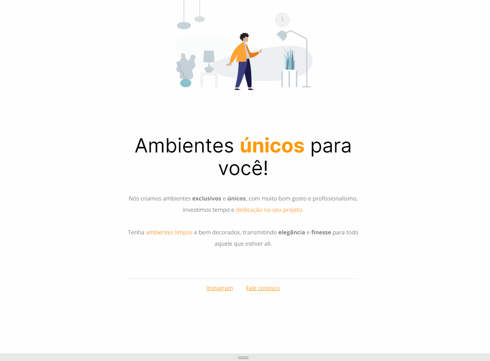

<h1 align="center">Móveis customizados   </h1>

 
 

  

 
    <a href="https://fernandoaugustodev.github.io/churrascometro" target="_blank" >Veja o Projeto</a>

## 💻 Sobre o Projeto
 

Atividade 01 - Explorer - Site estático onde foi aplicado alguns conceitos ensinado no modulo stage 01 

 

## 🛠 Techs

Tecnologias usadas neste projeto

- HTML
- CSS
- Estruturação da página em HTML
- Posição dos elementos na tela
- Aplicação de fontes customizadas
- Alinhamento de textos e elementos
- Responsividade
---

## 👨🏼‍💻 Autor

Fernando Augusto 

 
  
 
© 2022 GitHub, Inc.
Terms Privacy Security Status Docs
